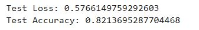
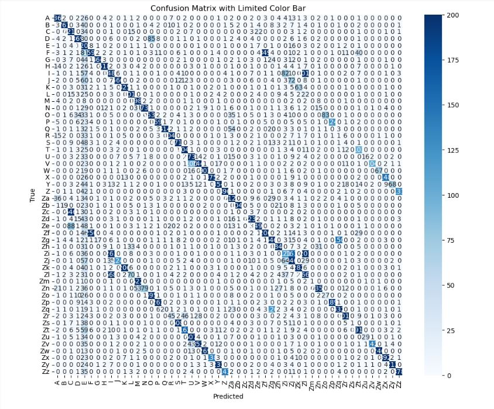
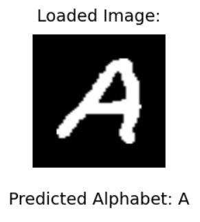
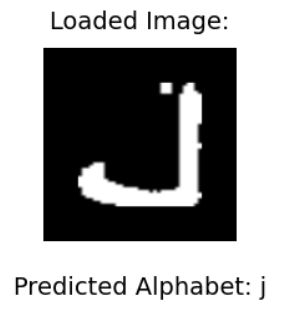
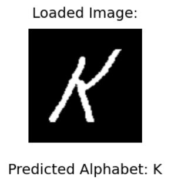
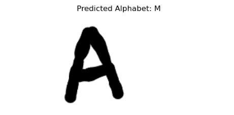

# Alphabet Recognition System - Using TensorFlow and Python  

## 📖 Overview  
The **Alphabet Recognition System** is an AI-based application designed to recognize and predict alphabet characters (`A-Z` and `a-z`) from images. This project leverages a custom-trained deep learning model using **TensorFlow/Keras** to deliver accurate predictions. It showcases an end-to-end pipeline, including preprocessing, training, and deployment of the model. The system uses the file path method for input, where the user sets the location of the image file to predict.

This project was primarily built as a learning exercise to understand the fundamentals of deep learning, from dataset preparation and model training to prediction and evaluation.

## ✨ Features  
✅ Supports recognition of both uppercase (`A-Z`) and lowercase (`a-z`) alphabets.  
✅ Utilizes TensorFlow/Keras for robust and efficient deep learning.  
✅ Preprocesses input images automatically for seamless predictions.  
✅ Displays the input image and prediction output for user verification.  
✅ Modular design for easy upgrades and scalability.  

## 🛠️ Technology Stack  
- **Programming Language**: Python  
- **Machine Learning Framework**: TensorFlow/Keras  
- **Visualization**: Matplotlib  
- **Image Processing**: Pillow (PIL)  
- **Data Handling**: NumPy

## 📊 Model Performance  
### Accuracy and Loss  
The model was trained for multiple epochs, and the performance metrics—accuracy and loss—were monitored throughout the training process.

### Confusion Matrix  
The confusion matrix below illustrates the model's performance across all classes (`A-Z` and `a-z`).  

From the matrix, we observe that certain lowercase letters, such as `l` and `i`, and uppercase letters like `O` and `Q`, tend to be misclassified due to their visual similarity.

## 🖼️ Prediction Results  
### Description  
This section highlights the model's real-world performance with example predictions. The model performs exceptionally well for most alphabets but struggles with visually similar letters, such as:  
- Uppercase letters: `O`, `Q`, and `D`.  
- Lowercase letters: `i`, `l`, and `j`.  

Below are examples of correct and incorrect predictions: 
#### Correct Predictions
Example 1: Predicted 'A'

Example 2: Predicted 'j'

Example 3: Predicted 'K'

#### Incorrect Predictions
Example 1: Predicted 'M' instead of 'A'

## 🌟 Future Enhancements
1. **Expanded Dataset**: Train the model with more alphabet image samples and more epochs for better accuracy.
2. **Live Webcam Integration:** Enable real-time alphabet recognition using a camera.
3. **Non-English Alphabets:** Expand support to include alphabets from other languages.
4. **User Interface**: Build a UI and make the process of loading input through a web app.
5. **Improved Accuracy:** Integrate advanced architectures like ResNet or EfficientNet for better performance.
